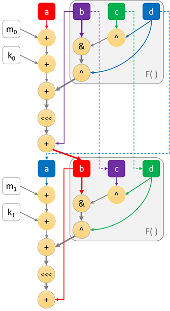
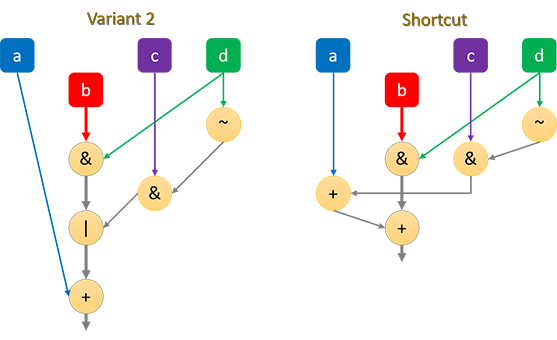
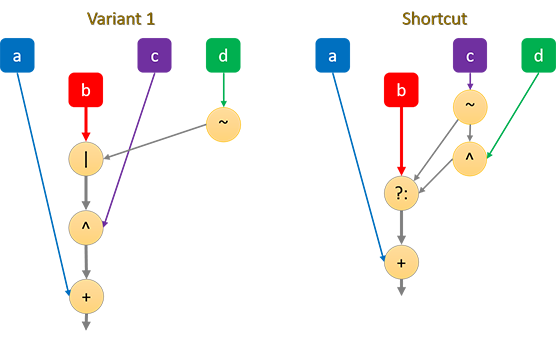
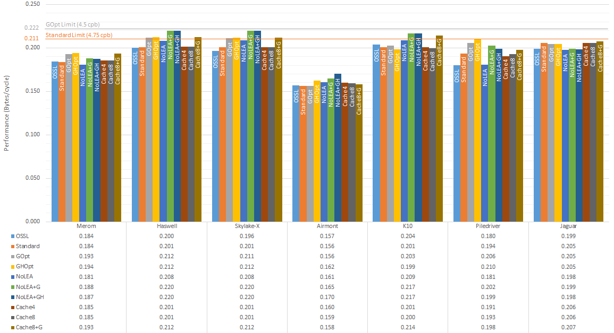
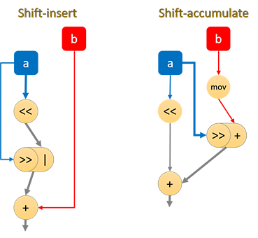

MD5 Optimisation Tricks: Beating OpenSSL’s Hand-tuned Assembly
===========================================

MD5 is a relatively old cryptographic hashing algorithm, which has been (and still is) widely used. As such, popular implementations are very well optimised at this point; OpenSSL uses hand-tuned assembly for its (x86) implementation, which is probably one of the most performant out there.

Putting aside the security concerns with using MD5 as a cryptographic hash, there have been few developments on the performance front for many years, possibly due to maturity of implementations and existing techniques considered to be optimal. Whilst writing my own implementation, I discovered some tricks which I’ve not seen used elsewhere, which are listed out in this document. Using these, I was able to [beat OpenSSL’s implementation](#speedup-vs-standard) by roughly 5% in the general case, and 23% for processors with AVX512 support.

### MD5 Overview

For a better/more complete description, check [Wikipedia](https://en.wikipedia.org/wiki/MD5#Algorithm), but here's a quick (incomplete) summary of the important bits of how MD5 works:

* MD5’s state is held in 4x 32-bit words, typically denoted using `a`, `b`, `c`, `d`
* Data, to be hashed, is processed in 64-byte (or 16x 32-bit word) blocks
* For each block, there are 64 mixing rounds, where each round updates one of the 32-bit words (out of the four) in the MD5 state
* The rounds are mostly identical, with a key difference being how three of the four 32-bit words (of the MD5 state) are mixed into the other word that is being updated for that round
* There are four such variations of how these three words are mixed, where the first 16 rounds use the “F” variant, the next 16 using “G”, then “H” and the final 16 rounds use “I”. See the diagram below for a visualisation of the operations which make up two rounds of the “F” variant (where “F” is highlighted with a grey box)

### MD5 Performance: A Latency Problem

Performance-wise, the key issue with MD5 is that the algorithm is mostly one long dependency chain. Because of this, MD5 is limited in what parallelism it can exploit on modern [superscalar processors](https://en.wikipedia.org/wiki/Superscalar_processor) (so much so that the more complex SHA1 hash often runs faster on modern processors).

The following diagram shows a typical optimised implementation of all the operations which occur in the first two rounds of MD5 (note `<<<` here denotes bit-rotate):



In the above diagram, the critical path (i.e. limiting dependency chain) is shown using bold lines/arrows. `a`, `b`, `c` and `d` refer to the four 32-bit word MD5 state, `m` is a 32-bit input word, `k` is a unique 32-bit constant, and `F( )` highlights the part which varies across rounds.

As can be seen, the critical path starts from the `b` input, which gets mixed into the `a` input, and continues on to subsequent rounds. As such, a core part of MD5 optimisation is to minimise the length of this critical path, even if it requires more instructions to do so. The way we can do this is by depending on `b` as late as possible when computing each round.
From the above diagram, each round would require a minimum of 5 clock cycles to compute (assuming each operation takes 1 cycle to complete, which is typical on modern processors). A processor which supports the bit-select instruction would enable the `F( )` function to be implemented in a single instruction, reducing the minimum cycle count per round to 4.

*See also*: Appendix A of [Intel’s “Fast Cryptographic Computation”](https://www.intel.com/content/dam/www/public/us/en/documents/white-papers/communications-ia-cryptographic-paper.pdf) for an alternative explanation

For a more complete picture, the following articles cover optimisations in existing implementations, so I won’t focus on the information already covered:

- [MD5 optimized for AMD64](https://www.zorinaq.com/papers/md5-amd64.html)
- [Fast MD5 hash implementation in x86 assembly](https://www.nayuki.io/page/fast-md5-hash-implementation-in-x86-assembly)

## Optimisation Tricks (Single Buffer)

### Dependency shortcut in G function

The G function is a bit-select, which, if your instruction set (ISA) doesn’t support natively, can be defined as one of the following two:

```c
#define G(b, c, d) (((b ^ c) & d) ^ c)
#define G(b, c, d) ((d & b) | (~d & c))
```

Despite needing more operations, it is noted that the second variant is likely more optimal, as it delays the need for the `b` input. In this case, `b` is needed to AND with `d`, then OR with the rest. The first variant, on the other hand, requires `b` to go through an XOR, AND and XOR.


<sup>*(for simplicity, the diagram only shows the operations for the G function, along with the subsequent addition to `a`)*</sup>
Existing optimised MD5 implementations should already be exploiting this trick.

Interestingly however, since the OR operation, of the second G function above, operates on distinct bits, it can be replaced with an ADD operation, e.g.:

```c
#define G(b, c, d) ((d & b) + (~d & c))
```

This change allows the commutative property of addition to be exploited. Consider the following code for a full round encompassing the G function (variant 2):

```c
a += source[i] + constant[i];
a += ((d & b) | (~d & c));
a = ROTATE(a, rotate_amount[i]);
a += b;
```

with the above transformation, it can be written as:

```c
a += source[i] + constant[i];
a += ~d & c;
a += d & b;
a = ROTATE(a, rotate_amount[i]);
a += b;
```

This delays the dependency on the `b` input by one operation (only AND operation required before joining with `a`).



### Dependency shortcut in I function

The I function is usually defined as

```c
#define I(b, c, d) ((~d | b) ^ c)
```

The `b` input has to go through a OR, then XOR.

If your ISA supports a bit-select instruction (e.g. [`BSL`](https://developer.arm.com/docs/ddi0602/g/simd-and-floating-point-instructions-alphabetic-order/bsl-bitwise-select) on ARM/NEON or [`VPCMOV`](https://en.wikipedia.org/wiki/XOP_instruction_set#Vector_conditional_move) on x86/XOP), the dependency chain can be shorted by one operation.
On a bitwise level, the I function can be written as `b ? !c : (!c ^ d)` (where `?...:` equates to the `BSL` instruction on ARM) so that the `b` input only has to go through a bit-select.



Unfortunately, neither x86 nor ARM have a non-SIMD bit-select instruction, so this generally doesn’t help on widely used platforms, but it may be useful for multi-buffer implementations.

The [SVE2](https://developer.arm.com/tools-and-software/server-and-hpc/compile/arm-instruction-emulator/resources/tutorials/sve/sve-vs-sve2/introduction-to-sve2) instruction set has a [`NBSL` instruction](https://developer.arm.com/docs/ddi0602/g/a64-sve-instructions-alphabetic-order/nbsl-bitwise-inverted-select), which can be remove the need for the NOT operation. Unfortunately, due to the destructive nature of this instruction, a move is still required.

### x86: AVX512 (VL extension)

Although SIMD doesn’t seem useful for (single buffer) MD5, AVX512 adds some useful instructions for the task, namely [rotate](https://www.felixcloutier.com/x86/vprold:vprolvd:vprolq:vprolvq) and [ternary-logic](https://en.wikipedia.org/wiki/AVX-512#Bitwise_ternary_logic). The latter instruction allows all of MD5’s mixing functions (F, G, H, I) to be [implemented in a single instruction](http://www.0x80.pl/articles/avx512-ternary-functions.html#md5-sha-1-and-sha-2-hashing-new), which is quite helpful in shortening the dependency chain as the `b` input only needs one operation before merging with `a`.

There are some AVX512 implementations of MD5 already out there which exploit this (such as Intel’s [isa-l_crypto](https://github.com/intel/isa-l_crypto/blob/master/md5_mb/md5_mb_x16x2_avx512.asm)), however they focus on multi-buffer. Because AVX512 instructions shorten the dependency chain, it performs significantly better than scalar implementations, even if only one 32-bit lane is being used.

Note that [AMD’s XOP instruction set](https://en.wikipedia.org/wiki/XOP_instruction_set) actually supports enough functionality to be roughly as efficient as AVX512 (F/G is a single [`VPCMOV` instruction](https://en.wikipedia.org/wiki/XOP_instruction_set#Vector_conditional_move), H/I only need `b` to go through one operation), however, XOP is only available on AMD family 15h (aka [Bulldozer line](https://en.wikipedia.org/wiki/Bulldozer_(microarchitecture))) processors. All such processors have a minimum 2 cycle latency for SIMD instructions, making the idea pointless for a fast single-buffer implementation.

### x86: Is LEA worth it?

x86 processors have the [`LEA` instruction](https://www.felixcloutier.com/x86/lea), which is commonly used to sum the round constant with the input word (or output of F/G/H/I function) in a single instruction. Most optimised implementations make use of this instruction.

However, on a number of modern Intel processors, [`LEA` (base+displacement+index) is quite slow](https://uops.info/html-instr/LEA_BID_R32.html) (3 cycle latency), where performing the 2 ADD operations separately is generally faster. However, the `LEA` is not performed on the critical path (as long as it’s summing the input word, not the F/G/H/I output), so one would expect it to have a minimal effect, however I have noticed performance improvements by avoiding it.

On some processors, using `LEA` does provide a slight speedup, so which strategy is ideal would depend on the processor you’re targeting.

### Short data hashing: skipping operations

If you’re generally hashing short strings, some operations can be skipped, however, the benefit of such is perhaps limited, but mentioned here nonetheless.

The first four rounds of MD5, when starting from the initial state, look like the following:

```c
A = 0x67452301;
B = 0xefcdab89;
C = 0x98badcfe;
D = 0x10325476;

// round 1
A += input[0] + 0xd76aa478 + F(B, C, D);
A = ROTATE_LEFT(A, 7);
A += B;
// round 2
D += input[1] + 0xe8c7b756 + F(A, B, C);
D = ROTATE_LEFT(D, 12);
D += A;
// round 3
C += input[2] + 0x242070db + F(D, A, B);
C = ROTATE_LEFT(C, 17);
C += D;
// round 4
B += input[3] + 0xc1bdceee + F(C, D, A);
B = ROTATE_LEFT(B, 22);
B += C;
```

Shown this way, one can probably easily see that the first few rounds can be simplified by expanding constants:

```c
// round 1
A = 0xd76aa477 + input[0];
A = ROTATE_LEFT(A, 7);
A += 0xefcdab89;
// round 2
D = 0xf8fa0bcc + input[1] + ((0x77777777 & A) ^ 0x98badcfe);
D = ROTATE_LEFT(D, 12);
D += A;
// round 3
C = 0xbcdb4dd9 + input[2] + (((A ^ 0xefcdab89) & D) ^ 0xefcdab89);
C = ROTATE_LEFT(C, 17);
C += D;
// round 4
B = 0x1b18b7a77 + input[3] + F(C, D, A);
B = ROTATE_LEFT(B, 22);
B += C;

// ...other rounds...

A += 0x67452301; // on x86, these may be merged with preceeding adds via LEA
B += 0xefcdab89;
C += 0x98badcfe;
D += 0x10325476;
```

A compiler should be able to perform this transformation if the supplied code allows it.

This simplification may provide a minor boost to performance on short inputs, but may require changes to the MD5 API.

If the amount of data to be hashed is typically less than a full 64 byte block, you could go further and skip adding input words which are known to be 0.

### Instruction reduction

Some instructions can be eliminated. Unfortunately, none of these changes shorten the dependency chain, so usually have a minimal impact on speed, however it does reduce code size, and could be helpful on processors with less superscalar width.

#### H function re-use

It may seem as if the H function (`b^c^d`) could be simplified by reusing a computation, e.g. the bracketed term in `(b^c)^d` could be used for the subsequent round’s `b^(c^d)` (remember, from one round to the next: `b` → `c` and `c` → `d`). Unfortunately, relying on `b` early hurts the dependency chain, so is not useful, but may be if you are throughput limited.

We can, however, use a similar idea on x86 to eliminate some `MOV` instructions:

```c
tmp = b ^ (c ^ d); // result of H function
a += tmp; // add to `a`, as usually required
tmp ^= d; // gives b ^ c, which can be used next round as a pre-computed `c ^ d`
```

For example:

```assembly
; first H round
mov tmp, D  ; tmp = D
xor tmp, C  ; tmp ^= C
xor tmp, B  ; tmp ^= B
; subsequent H rounds (where tmp == C^D^A)
xor tmp, A  ; tmp ^= A  (avoids MOV instruction)
xor tmp, B  ; tmp ^= B
```

#### Cache inputs in registers

If there is enough spare registers, input words can be held there, which eliminates the need to reload them from memory. Even if there isn’t enough registers to hold all 16 words of a round, some can be used for caching. Note that this may be less beneficial when hashing shorter strings, as it may require more registers be popped on/off the stack.

If a partial caching approach is taken, it is best to separate the cached inputs evenly. For example, if 8 of the 16 words are to be cached to registers, caching all odd or caching all even inputs is probably better than caching the first/last 8 inputs.

#### ISA Extensions

The [BMI1 extension](https://en.wikipedia.org/wiki/Bit_manipulation_instruction_set#BMI1_(Bit_Manipulation_Instruction_Set_1)) for x86 provides the [`ANDN` instruction](https://www.felixcloutier.com/x86/andn), which saves a `NOT` when computing the G function. The VEX encoding nature of the instruction can be used to save a `MOV` instruction as well.

The [`EOR3` instruction](https://developer.arm.com/docs/ddi0602/g/simd-and-floating-point-instructions-alphabetic-order/eor3-three-way-exclusive-or) in SVE2 or SHA3 NEON extensions enables the H function to be computed in a single instruction, but is only available for SIMD operations. The destructive nature of the [SVE2 version of this instruction](https://developer.arm.com/docs/ddi0602/a/a64-sve-instructions-alphabetic-order/eor3-bitwise-exclusive-or-of-three-vectors) may require an additional move, although this can be avoided with the [trick shown above](#h-function-re-use).


## Benchmarks (Single Buffer)

This is a quick benchmark, comparing the code in this repository with a statically built OpenSSL v1.1.1h, on a few different x86 processor micro-architectures. The benchmark focuses on long inputs (most of the optimisations here shouldn't be detrimental to short inputs), so the 16KB reading from `openssl speed md5` was used. The OpenSSL test was performed 3 times, and the fastest reading taken, to minimise the effect of other OS interactions.

Processors were locked to a particular frequency during testing. Readings have been normalised to bytes/cycle so that all processors tested are on a similar scale. Code was compiled via Clang 11.0.0 x86-64.

Explanation of tests:

* **OSSL**: the reading taken from OpenSSL’s MD5 speed test
* [**Standard**](https://github.com/animetosho/md5-optimisation/blob/e42661105e971c94d0397e5b41bcf0a58e5874d3/md5-x86-asm.h#L35): base algorithm used for comparison, which should roughly equate with OpenSSL in speed. This is included as a control variable since the testing methodology between OpenSSL and this benchmark may differ
* [**GOpt**](https://github.com/animetosho/md5-optimisation/blob/e42661105e971c94d0397e5b41bcf0a58e5874d3/md5-x86-asm.h#L201): the ‘Standard’ algorithm with the G function shortcut
* [**GHOpt**](https://github.com/animetosho/md5-optimisation/blob/e42661105e971c94d0397e5b41bcf0a58e5874d3/md5-x86-asm.h#L306): the ‘GOpt’ algorithm with some `MOV` instructions removed in the H function
* [**NoLEA**](https://github.com/animetosho/md5-optimisation/blob/e42661105e971c94d0397e5b41bcf0a58e5874d3/md5-x86-asm.h#L413): ‘Standard’ algorithm with `LEA` instructions replaced with 2 ADDs
* [**NoLEA+G**](https://github.com/animetosho/md5-optimisation/blob/e42661105e971c94d0397e5b41bcf0a58e5874d3/md5-x86-asm.h#L544): combination of ‘NoLEA’ and ‘GOpt’
* [**NoLEA+GH**](https://github.com/animetosho/md5-optimisation/blob/e42661105e971c94d0397e5b41bcf0a58e5874d3/md5-x86-asm.h#L614): combination of ‘NoLEA’ and ‘GHOpt’
* [**Cache4**](https://github.com/animetosho/md5-optimisation/blob/e42661105e971c94d0397e5b41bcf0a58e5874d3/md5-x86-asm.h#L705): the 'Standard' algorithm, where four (out of 16) of the inputs are cached in registers
* [**Cache8**](https://github.com/animetosho/md5-optimisation/blob/e42661105e971c94d0397e5b41bcf0a58e5874d3/md5-x86-asm.h#L866): above, but with eight inputs cached
* [**Cache8+G**](https://github.com/animetosho/md5-optimisation/blob/e42661105e971c94d0397e5b41bcf0a58e5874d3/md5-x86-asm.h#L1030): above combined with ‘GOpt’
* [**AVX512**](https://github.com/animetosho/md5-optimisation/blob/e42661105e971c94d0397e5b41bcf0a58e5874d3/md5-x86-asm.h#L1144): implementation using AVX512 instructions (this reading is excluded from chart as only the Skylake-X processor tested supports this; table further down below shows the measurement)



Note: the “limit” lines above refer to the theoretical speed limit of the implementation:

* **Standard**: F, G, I rounds require at least 5 cycles to compute, whilst H can be completed in 4 cycles, hence an overall of 4.75 cycles per round (which also corresponds to 4.75 cycles per byte) being the theoretical limit
* **GOpt**: this reduces the G rounds by one cycle, resulting in a theoretical limit of 4.5 cycles per round/byte
* **AVX512**: this reduces all rounds to 4 cycles, so a limit of 4 cycles per round/byte

#### Speedup vs Standard

The above data, presented in terms of % speedup:

| Method   |  Merom | Haswell | Skylake-X | Airmont |    K10 | Piledriver | Jaguar |
| -------- | -----: | ------: | --------: | ------: | -----: | ---------: | -----: |
| Standard |  0.00% |   0.00% |     0.00% |   0.00% |  0.00% |      0.00% |  0.00% |
| GOpt     | +4.99% |  +5.37% |    +5.35% |   0.00% | +0.85% |     +6.27% | -0.38% |
| GHOpt    | +5.63% |  +5.56% |    +5.64% |  +3.72% | -1.24% |     +8.47% | -0.38% |
| NoLEA    | -1.71% |  +3.59% |    +3.97% |  +2.79% | +3.91% |     -6.65% | -3.70% |
| NoLEA-G  | +2.43% |  +9.35% |    +9.70% |  +5.40% | +7.76% |     +4.49% | -3.06% |
| NoLEA-GH | +1.93% |  +9.27% |    +9.66% |  +8.66% | +7.76% |     +2.75% | -3.51% |
| Cache4   | +0.93% |  +0.15% |    +0.20% |  +2.19% | -0.13% |     -1.59% | +0.19% |
| Cache8   | +0.86% |  +0.17% |    +0.26% |  +1.68% | -0.72% |     -0.39% | +0.06% |
| CacheG   | +5.14% |  +5.56% |    +5.55% |  +1.21% | +6.65% |     +2.21% | +1.02% |
| AVX512   |        |         |   +23.11% |         |        |            |        |

#### Observations

* Speed reading from OpenSSL and ‘Standard’ are generally roughly the same, though the latter is sometimes faster (I’m not sure of the reason). The latter is what’s being used for speed comparisons here
* As expected, the G function shortcut typically provides a benefit, or at least, isn’t detrimental to performance
* Eliminating `MOV` instructions in the H function seems to have a minor effect (except on Airmont, where it’s more pronounced)
* Replacing `LEA` instructions with 2 ADDs seems to be beneficial on some processors, detrimental on others
* Caching inputs in registers seems to have a very minor effect
* Reference speed on [Wikipedia](https://en.wikipedia.org/wiki/Template:Comparison_of_SHA_functions) lists Skylake at 4.99 cycles/byte (cpb), which matches the ‘Standard’ measurement. Using the optimisation tricks shown, this can be reduced to 4.734 cpb (+5.35% from GOpt) or 4.546 cpb (+9.70% from NoLEA+GOpt). If AVX512 is available, this can be further reduced to 4.051 cpb (+23.11%).

## Optimisation Tricks (Multi-Buffer)

Since MD5 is latency bound, one could try to make better use of [instruction-level parallelism](https://en.wikipedia.org/wiki/Instruction-level_parallelism) (as well as data-level parallelism, i.e. [SIMD](https://en.wikipedia.org/wiki/SIMD)) by computing multiple hash streams concurrently. Obviously, this only works if you need more than one MD5 hash. If so, [Intel has a library](https://github.com/intel/isa-l_crypto/blob/master/md5_mb/) for doing such.

Alternatively, if other processing with the data needs to be performed, you can try applying ‘[function stitching](https://www.intel.com/content/dam/www/public/us/en/documents/white-papers/communications-ia-cryptographic-paper.pdf)’ to assist parallelism. This technique is specific to your situation, so won’t be explored here.

### Rotate Emulation in SIMD

A number of SIMD ISAs don’t have a rotate instruction. The classic way to emulate this is via two bit shifts plus a bitwise OR. There may be a better approach however.

#### Rotate by 16

Four out of the 64 rounds involves a rotate by 16, which can be emulated via byte shuffling techniques. On ARM, the [`VREV32` instruction](https://developer.arm.com/docs/ddi0602/g/simd-and-floating-point-instructions-alphabetic-order/rev32-vector-reverse-elements-in-32-bit-words-vector) using 16-bit words, or x86 using [`PSHUFLW/HW`](https://www.felixcloutier.com/x86/pshuflw) or [`PSHUFB`](https://www.felixcloutier.com/x86/pshufb).

As this only affects 1/16th of the rounds, the overall benefit is quite small.

#### NEON: Fancy shifts

The NEON instruction set supports a [shift-and-insert instruction](https://developer.arm.com/docs/ddi0602/g/simd-and-floating-point-instructions-alphabetic-order/sri-shift-right-and-insert-immediate), which combines a shift and OR operation.

Alternatively, the [shift-right-accumulate (SRA) instruction](https://developer.arm.com/docs/ddi0602/g/simd-and-floating-point-instructions-alphabetic-order/usra-unsigned-shift-right-and-accumulate-immediate) may be more beneficial, as long as the accumulation is performed on the `b` value rather than the shifted `a` value. This is because the SRA instruction can be executed alongside the necessary shift-left instruction. Unfortunately, the destructive nature of the SRA instruction means an extra move is required to make it work that way. Also, SRA seems to have longer latencies than shift-insert on a number of Cortex CPUs, meaning that there may actually be a speed regression.



#### SVE2: Unneeded XOR

SVE2 doesn’t have a plain rotate instruction, but it does have a curious [XOR-and-rotate](https://developer.arm.com/docs/ddi0602/a/a64-sve-instructions-alphabetic-order/xar-bitwise-exclusive-or-and-rotate-right-by-immediate) (not EOR-and-rotate?) instruction. So if it performs reasonably well, just XOR with 0 and only exploit the rotate functionality.
Note that the [NEON-SHA3 `XAR` instruction](https://developer.arm.com/docs/ddi0602/g/simd-and-floating-point-instructions-alphabetic-order/xar-exclusive-or-and-rotate) performs a 64-bit rotate, so won’t work here, though it could for the following section.

#### Two buffers on 128-bit SIMD: shuffle + 64-bit shift

If you’re only computing 2x MD5 streams on SSE (which supports 4x), you can place the active lanes at positions 0 and 2. The rotate can be emulated by duplicating these lanes to positions 1 and 3, then doing a 64-bit right-shift.
In other words, the following two functions give the same result:

```c
uint32_t rotl_obvious(uint32_t value, int amount) {
	return (value << amount) | (value >> (32-amount));
}

uint32_t rotl_dupe(uint32_t value, int amount) {
	uint64_t tmp = value * 0x100000001ULL;
	return tmp >> (32-amount);
}
```

Implemented in SIMD, reduces the process from 4 instructions to 2 instructions:

```assembly
; obvious rotate
movdqa tmp, a     ; tmp = a
psrld  a, n       ; a >>= n
pslld  tmp, 32-n  ; tmp <<= 32-n
por    a, tmp     ; a |= tmp

; duplicate method
pshufd a, a, 0b10100000 ; duplicate lanes 0/2 to lanes 1/3
psrlq  a, 32-n    ; a >>= 32-n
```

For NEON with SHA3 extensions, [`XAR`](https://developer.arm.com/docs/ddi0602/g/simd-and-floating-point-instructions-alphabetic-order/xar-exclusive-or-and-rotate) may also be used instead of a shift - this avoids the need to shuffle lanes, unlike SSE, as the rotate keeps lanes 0 and 1 identical, as well as lanes 2 and 3.

#### Multiply-add

Some ISAs provide an integer multiply-accumulate instruction, which can be equivalent to a left-shift + add instruction. Unfortunately, multiplication often has high latency, so usually isn’t worthwhile. If you do decide to go this route however, consider accumulating with the `b` input instead of the right-shifted `a` value, to shorten the dependency chain (see [NEON: Fancy shifts](#neon-fancy-shifts) above).

